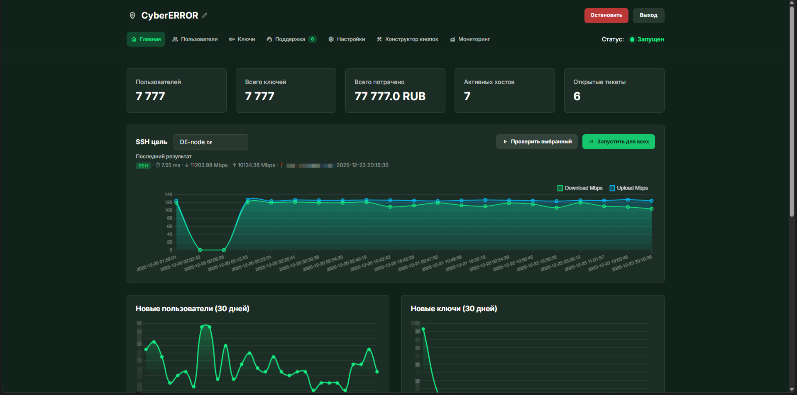
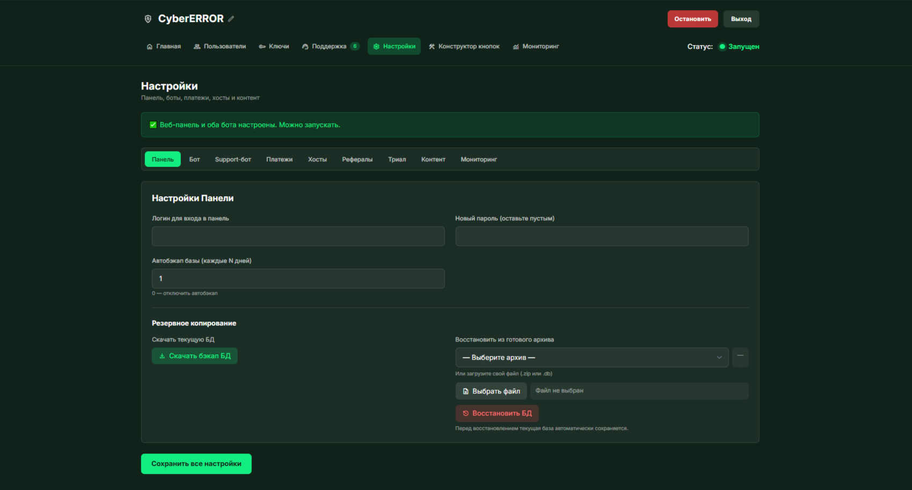
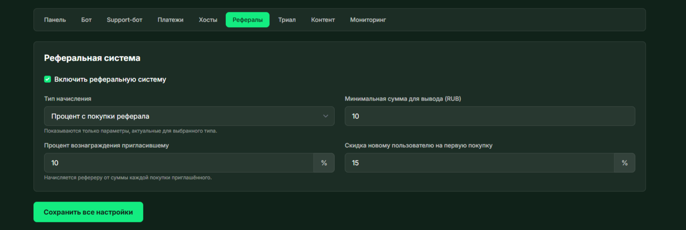
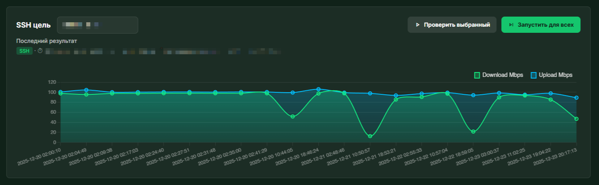
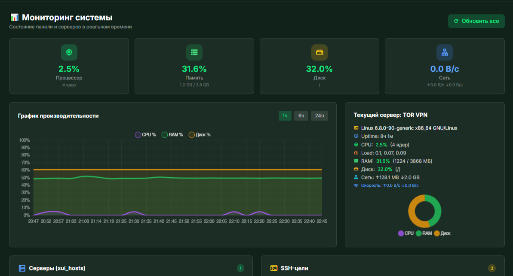
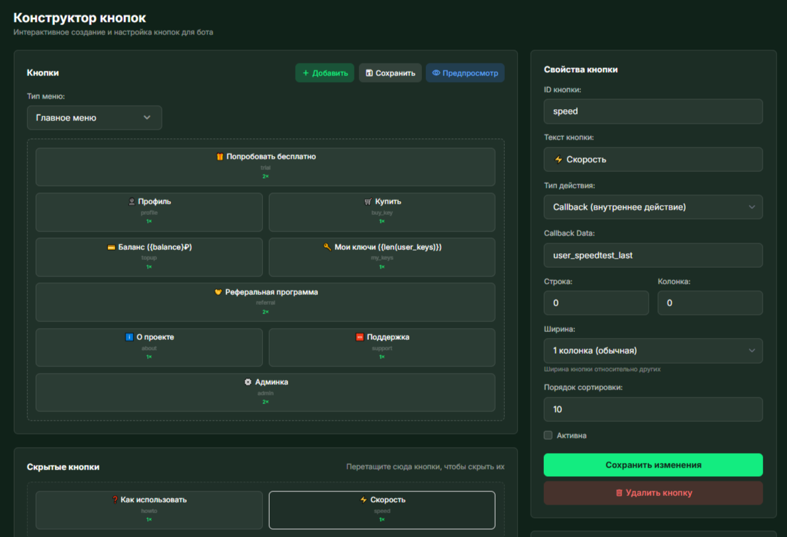
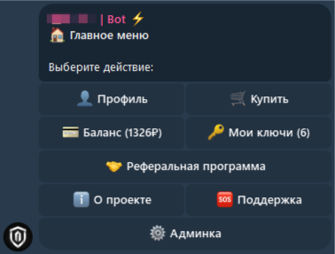
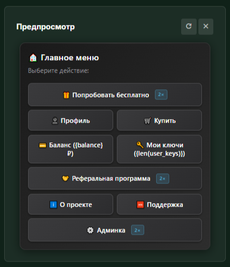

# 🛍️ Remnawave ShopBot

> **Telegram-бот для полностью автоматизированной продажи VPN-конфигураций с веб-панелью управления**
>

<div align="center">

[](https://github.com/CyberERROR/remnawave-shopbot/releases)
[](https://github.com/CyberERROR/remnawave-shopbot/releases)
[](LICENSE)
[](https://github.com/CyberERROR/remnawave-shopbot/commits)
[](https://github.com/CyberERROR/remnawave-shopbot/issues)
[](https://github.com/CyberERROR/remnawave-shopbot/stargazers)
[](https://www.python.org/downloads/)

[Установка](#️-быстрая-установка-под-ключ) • [Документация](#️-первичная-конфигурация) • [Платёжные системы](#-платёжные-системы) • [Скриншоты](#️-скриншоты) • [Поддержка](#-техническая-поддержка)
</div>

---

<p align="center">

</p>

<div align="center">
   
###  Наш Telegram
[Присоединяйтесь к сообществу](https://t.me/+YV_BO1cmGWw5OTdi)

</div>

---

## 📋 Описание

**Remnawave ShopBot** — комплексное решение для автоматизированной продажи VPN-конфигураций через Telegram. Проект объединяет мощный Telegram-бот с интуитивной веб-панелью на базе Tabler для полного управления услугой.

**Идеально подходит для:**
- 🌍 Провайдеров VPN-услуг
- 💼 Агентств с собственными серверами
- 👨‍💻 Разработчиков и DevOps-инженеров
- 🚀 Стартапов в сфере VPN и приватности

---

## ✨ Основные возможности

### 🤖 Telegram-бот
- ✅ **Полная автоматизация**: от регистрации до выдачи конфига после оплаты
- ✅ **Смарт-онбординг**: пошаговая регистрация с валидацией данных
- ✅ **Админ-меню**: управление ботом из Telegram без выхода в панель
- ✅ **Тестовый период (trial)**: пользователи могут попробовать сервис
- ✅ **Принудительная подписка**: на канал/группу перед покупкой
- ✅ **Таймер подписки**: детальное отображение времени в формате Годы:Месяцы:Дни:Часы:Минуты

### 💼 Веб-панель управления

#### **Дашборд и мониторинг**
- 📊 Статистика пользователей, продаж, баланса
- 🔔 Недавние события (платежи, новые пользователи, трайлы)
- 🎛️ Блок активных ключей и трендов
- 🚨 Визуальная индикация нагрузки на серверы (цветовой код)

#### **Управление хостами**
- 🖥️ Мульти-хост архитектура: любое число серверов 3x-ui с центральным управлением
- 🔧 SSH-интеграция для выполнения команд на удалённых серверах (Beta)
- 📈 Мониторинг ресурсов (CPU, RAM, HDD, трафик)
- 🔄 Автоматическое обновление панели Remnawave и нод

#### **Управление тарифами**
- 💰 Гибкие тарифы: настройка месяцев/цены **для каждого хоста отдельно**
- 🎯 Трёхуровневая ценовая стратегия
- 📱 Лимиты: ограничение устройств и трафика **по тарифам индивидуально**

#### **Управление пользователями и подписками**
- 👥 Полная информация о пользователе
- 🔑 Управление подписками: изменение сроков, удаление, комментарии
- 📝 История платежей и транзакций баланса
- 🧑‍🤝‍🧑 Отслеживание рефералов с возможностью перехода в их профиль

#### **Техническая поддержка**
- 💬 Встроенная система чатов с пользователями
- 🤖 **Gemini AI** для генерации ответов (генерация с нуля или дополнение текста)
- ⚡ AJAX-сохранение без перезагрузки страницы
- 📋 Управление чатами: открытие, закрытие, удаление из общего списка

#### **Статистика и аналитика**
- 📊 Детальные отчёты по платежам и доходам
- 📈 Графики трафика и активности пользователей
- 📅 Фильтрация по датам и критериям

### 🔧 Система управления

#### **Спидтесты и мониторинг**
- ⚡ **SSH-speedtest**: запуск speedtest-cli на удалённых серверах
- 🌐 **Net-Probe**: быстрая проверка доступности и пинга
- 📊 Автоматическое сохранение результатов в БД
- 🧹 Глубокая очистка метрик с VACUUM оптимизацией БД

#### **Платёжные системы**
- 🟡 **YooKassa**: полная интеграция с опциональной выдачей чеков
- 🔗 **Platega**: поддержка платежной системы
- 🤖 **CryptoBot** (Telegram Stars): крипто-платежи
- 💎 **Heleket**: альтернативный платёжный провайдер
- ⚡ **TON Connect**: прямые платежи в TON (с курсовой конвертацией)
- 📝 **Автоматическое заполнение комментариев платежей**: Telegram ID, Username, Name пользователя

#### **Реферальная система**
- 🎁 **Гибкие модели начисления**:
  - Процент с покупки реферала
  - Фиксированная сумма за покупку
  - Бонус приглашающему при регистрации
- 💸 Управление скидками рефералов
- 🔗 Автоматическая генерация рефссылок
- 💰 Минимум для вывода средств

#### **Конструктор интерфейса**
- 🎛️ **Конструктор кнопок**: создание и кастомизация меню бота
- 🎨 Визуальный редактор макетов
- 📋 Сохранение предустановок

### 🔐 Безопасность
- 🛡️ Защита от несанкционированного доступа
- 🔑 Управление API-ключами и токенами
- 🔒 Шифрование чувствительных данных
- 📋 Логирование всех действий администраторов

---

## 📊 Сравнение с конкурентами

| Функция | Remnawave ShopBot | Конкуренты |
|:---|:---:|:---:|
| Автоматизированная продажа VPN | ✅ | ✅ |
| Веб-панель управления | ✅ | ⚠️ Ограничено |
| Мульти-хост архитектура | ✅ | ❌ Обычно 1 хост |
| AI-поддержка (Gemini) | ✅ | ❌ |
| Спидтесты SSH + Net-Probe | ✅ | ⚠️ Зависит от версии |
| 5+ платёжных систем | ✅ | ⚠️ 2-3 обычно |
| Реферальная система | ✅ | ⚠️ Базовая |
| TON Connect для крипто | ✅ | ⚠️ Редко |
| Конструктор меню бота | ✅ | ❌ |
| Управление командами на серверах | ✅ | ❌ |

---

## 🖼️ Скриншоты

<details>
<summary><b>📸 Показать скриншоты</b></summary>

<br>

| Веб-панель | |
|:---:|:---:|
|  |  |
| Дашборд | Настройки |
|  |  |
| Рефералы | Спидтесты |
|  |  |
| Мониторинг системы | Конструктор кнопок |

| Telegram-бот | |
|:---:|:---:|
|  |  |
| Главное меню | Настройки и помощь |
|  |  |
| Админ-меню | Предпросмотр меню |

<sub>💡 Клик по картинке откроет оригинал в полном размере</sub>

</details>

---

## 🔧 Последний релиз

### ⚡ [v1.3.2](https://github.com/CyberERROR/remnawave-shopbot/releases/tag/1.3.2) — ИИ в поддержке, гибкие лимиты и контроль серверов

**🤖 Gemini AI для техподдержки**
- Автогенерация ответов на основе контекста диалога
- Дополнение неполных ответов администратора
- Использование бесплатной модели `gemini-2.5-flash`

**👤 Расширенное управление пользователями**
- Новое окно информации о пользователе с вкладками
- Отслеживание пригласившего реферала
- Изменение сроков подписок прямо в интерфейсе
- История платежей и транзакций баланса

**⚙️ Гибкие лимиты тарифов**
- Лимит устройств и трафика **индивидуально для каждого тарифа**
- Убрана единая система лимитов

**🖥️ Управление серверами**
- Цветовая индикация нагрузки на серверы
- **Выполнение команд на серверах** (Beta): обновление панели Remnawave и нод
- Глубокая очистка метрик с VACUUM оптимизацией

**🐛 Улучшения**
- Таймер подписки больше не уходит в минус (показывает "Истек")
- Детализированное отображение времени подписки
- AJAX-сохранение форм без перезагрузки
- Исправлены визуальные баги

**[Полный список изменений →](https://github.com/CyberERROR/remnawave-shopbot/releases/tag/1.3.2)**

---

## ⚠️ Требования к серверу

- 🐧 **ОС**: Ubuntu 20.04+ / Debian 11+
- 🔑 **Доступ**: SSH с правами root
- 🌐 **Домен**: A-запись должна указывать на IP сервера
- 📦 **Remnawave Platform**: установлена на целевых хостах 3x-ui
- 💾 **Ресурсы**: 1GB RAM, 10GB свободного места (минимум)
- 🐳 **Docker & Docker Compose**: будут установлены автоматически

---

## 🛠️ Быстрая установка «под ключ»

Установочный скрипт автоматически развернёт Docker, Nginx, Certbot, бота и панель.

### 1️⃣ Подключитесь по SSH

```bash
ssh root@your-server-ip
```

### 2️⃣ Запустите установщик

```bash
curl -sSL https://raw.githubusercontent.com/CyberERROR/remnawave-shopbot/main/install.sh | bash
```

### 3️⃣ Следуйте инструкциям

Установщик запросит:
- **Домен** (например: `shop.example.com`)
- **Email** для SSL-сертификата (Let's Encrypt)
- **Порт вебхуков** (443 или 8443, рекомендуется 8443)

Скрипт автоматически:
- ✅ Установит Docker и Docker Compose
- ✅ Настроит Nginx как reverse proxy
- ✅ Выпустит SSL-сертификат через Certbot
- ✅ Поднимет контейнеры с ботом и панелью
- ✅ Настроит автообновление сертификата

### 4️⃣ После установки

```
🎉 Установка завершена!

Веб-панель:      https://shop.example.com/login
Логин:           admin
Пароль:          admin

📝 Важно: Немедленно смените пароль в панели!
```

---

## 🔄 Управление и обновления

Все команды выполняются в папке проекта:

```bash
cd /root/remnawave-shopbot
```

### 📋 Основные команды

```bash
# Просмотр логов в реальном времени
docker-compose logs -f

# Перезапуск контейнеров
docker-compose restart

# Остановка (контейнеры остаются)
docker-compose stop

# Полная остановка с удалением контейнеров
docker-compose down

# Запуск в фоне
docker-compose up -d

# Пересборка и запуск
docker-compose up -d --build

# Очистка логов Docker
truncate -s 0 /var/lib/docker/containers/*/*-json.log
```

### 🆕 Обновление до последней версии

```bash
# Запустить установщик (загружает свежую версию)
curl -sSL https://raw.githubusercontent.com/CyberERROR/remnawave-shopbot/main/install.sh | bash

# Пересоздать контейнеры с новым кодом
cd /root/remnawave-shopbot && docker-compose down && docker-compose up -d --build
```

### 🗑 Полное удаление
```bash
# Запустить скрипт удаления (полностью удаляет бота и связанные контейнеры)
curl -sSL https://raw.githubusercontent.com/CyberERROR/remnawave-shopbot/main/uninstall.sh | bash
```

---

## ⚙️ Первичная конфигурация

### Безопасность
1. Откройте панель: `https://your-domain.com/login`
2. Авторизуйтесь: `admin` / `admin`
3. **Немедленно смените** пароль в **Настройки → Настройки панели**

### Telegram-бот
В **Настройки → Telegram параметры**:
- **Токен бота** — получить у [@BotFather](https://t.me/botfather)
- **Имя бота** — username бота
- **ID администратора** — ваш Telegram ID (узнать у [@userinfobot](https://t.me/userinfobot))

### Remnawave хосты
В **Настройки → Управление хостами** добавьте хосты:
- **URL хоста**: `https://host.example.com:10443`
- **API доступы**: логин и пароль к Remnawave API
- **SSH параметры**: адрес, порт, пользователь (для спидтестов и команд)

### Тарифы и запуск
1. Создайте пакеты подписки в **Тарифы** для каждого хоста
2. Сохраните все настройки
3. Нажмите **«Запустить бота»** в шапке панели

🎊 **Готово!** Бот принимает заказы.

---

## 💳 Платёжные системы

Откройте **Настройки → Платёжные системы** и выберите нужные способы оплаты.

### 🟡 YooKassa

```
1. Заполните поля:
   • yookassa_shop_id      → ID магазина
   • yookassa_secret_key   → Секретный ключ
   • Почта для чеков       → (опционально)

2. В кабинете YooKassa установите вебхук:
   https://your-domain.com/yookassa-webhook
   
   Если порт 8443:
   https://your-domain.com:8443/yookassa-webhook
```

### 🔗 Platega

```
1. Заполните:
   • Merchant ID
   • API Key

2. Настройте вебхук:
   https://your-domain.com/platega-webhook
```

### 🤖 CryptoBot (Telegram Stars)

```
1. Откройте @CryptoBot → Crypto Pay
2. Скопируйте токен
3. Вставьте в поле cryptobot_token
4. Включите вебхуки на:
   https://your-domain.com/cryptobot-webhook
```

### 💎 Heleket

```
Заполните:
• heleket_merchant_id
• heleket_api_key
```

### ⚡ TON Connect (опционально)

```
Для отображения курсов в TON:
• ton_wallet_address
• tonapi_key
```

---

## 🔗 Принудительная подписка

Настройки в веб-панели (**Настройки → Общие**):

| Параметр | Назначение |
|:---|:---|
| **force_subscription** | Включить обязательную подписку (`true`/`false`) |
| **channel_url** | Ссылка на канал/группу для подписки |
| **terms_url** | Ссылка на условия использования |
| **privacy_url** | Ссылка на политику конфиденциальности |

⚠️ **Важно**: Бот должен быть администратором канала для проверки подписки!

---

## 🧪 Спидтесты и мониторинг

Доступны **2 метода** проверки скорости:

### 📊 SSH-Speedtest
- Запускает `speedtest-cli` на удалённом сервере
- Требует SSH доступа и установленного speedtest
- **Автоустановка**: из админ-меню бота или веб-панели

**Запуск:**
```
Бот:   Админ-меню → Speedtest → Выбрать хост
Панель: Дашборд → Кнопка "Run speedtests"
```

### 🌐 Net-Probe
- Проверка доступности и пинга HTTP
- Без необходимости SSH
- Более быстрый результат

**Результаты**: автоматически сохраняются в БД и видны на дашборде у каждого хоста.

---

## 🤝 Реферальная система

**Основные параметры** в **Настройки → Общие**:

### Типы начисления
- 📊 **Процент с покупки** реферала (например, 10%)
- 💰 **Фиксированная сумма** за каждую покупку
- 🎁 **Бонус приглашающему** при регистрации реферала

### Дополнительно
- **Скидка реферала**: процент скидки для приглашённого
- **Минимум вывода**: минимальная сумма для перевода средств

### Рефссылка
Автоматически генерируется в формате:
```
https://t.me/<bot_username>?start=ref_<telegram_id>
```

---

## 🆘 Техническая поддержка

Доступны **2 режима** поддержки пользователей:

### 1️⃣ Внешний саппорт-бот
```
Параметры:
• support_bot_token    → токен бота поддержки
• support_bot_username → username бота
• support_text         → текст кнопки

Пользователь переходит в отдельного бота по кнопке "Помощь"
```

### 2️⃣ Внешний контакт
```
Параметр:
• support_user → username контакта (например: @admin)

Кнопка ведёт в личные сообщения контакту
```

### 🤖 AI-ассистент в панели
```
Доступен в разделе "Поддержка" панели:
• Для работы нужен токен Gemini AI
• Генерирует ответы на основе контекста диалога
• Дополняет неполные ответы администратора
```

### Расширенные сценарии
```
Параметр:
• support_forum_chat_id → ID форума/топиков для сложных вопросов
```

---

## 📝 Документация

- [📖 Гайд по установке в архиве](https://github.com/CyberERROR/remnawave-shopbot/releases)
- [🔗 API документация](docs/api.md)
- [⚙️ Конфигурация и переменные окружения](docs/config.md)
- [🐛 Решение проблем](docs/troubleshooting.md)

---

## 🐛 Баги и предложения

Если вы нашли баг или хотите предложить улучшение:

1. Проверьте [Issues](https://github.com/CyberERROR/remnawave-shopbot/issues) — возможно, это уже известно
2. Создайте новый issue с описанием:
   - Что произошло
   - Как это воспроизвести
   - Ваша ОС и версия бота
3. Прикрепите логи из панели: **Дашборд → Логи**

---

## 💎 Авторство

**Исходный код и все права принадлежат:** [@tweopi](https://github.com/tweopi)

**Текущая поддерживаемая версия:** [v1.3.2](https://github.com/CyberERROR/remnawave-shopbot/releases/tag/1.3.2)

**Актуальные релизы:** [Releases](https://github.com/CyberERROR/remnawave-shopbot/releases)

---

## 📄 Лицензия

Проект распространяется по лицензии [GPLv3](LICENSE).

Вы можете свободно использовать, изучать, модифицировать и распространять этот код при условии соблюдения лицензии.

---

<div align="center">

**Сделано с ❤️ для сообщества**

[⭐ Звёздочка на GitHub](https://github.com/CyberERROR/remnawave-shopbot) поддержит развитие проекта

</div>