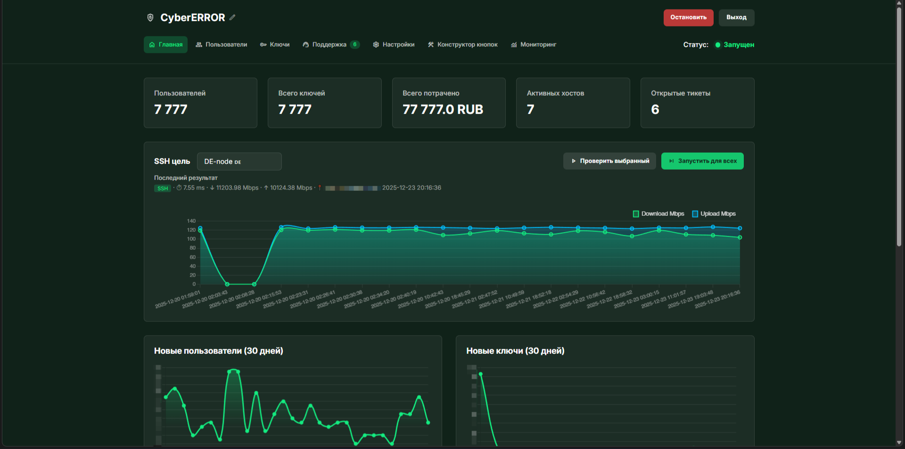
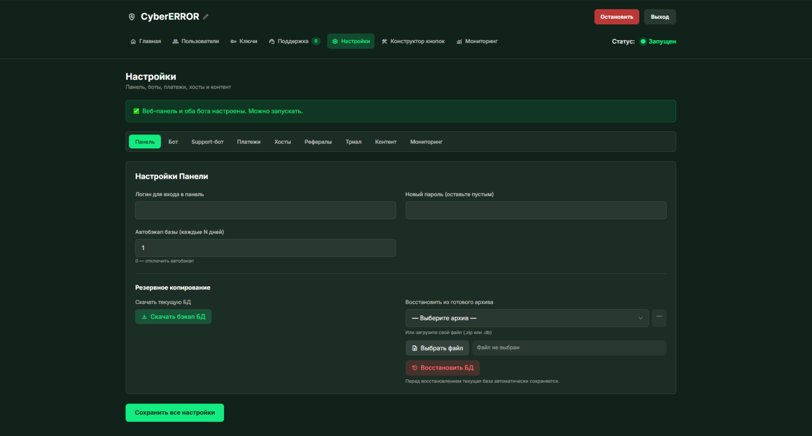
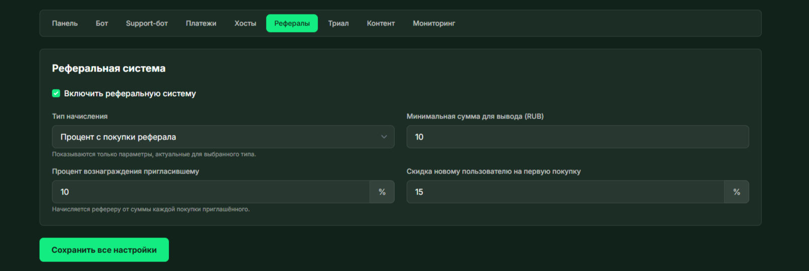
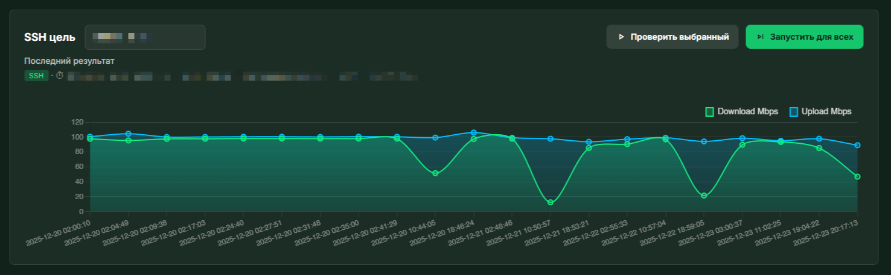
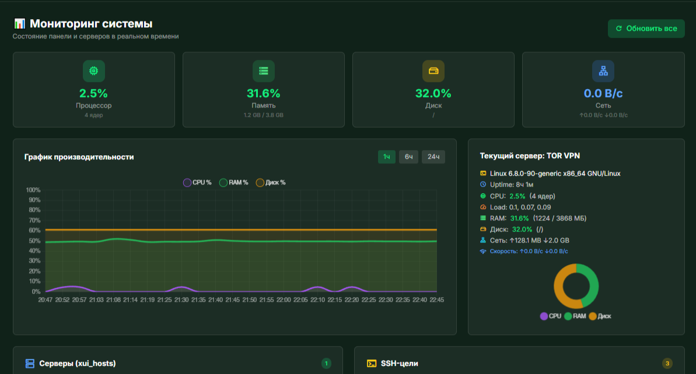
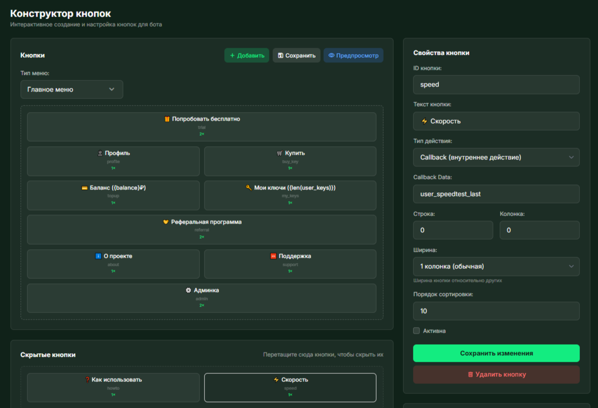
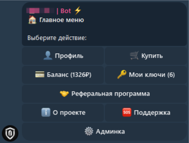
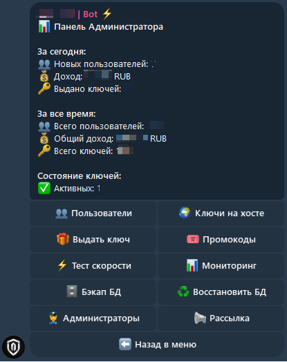
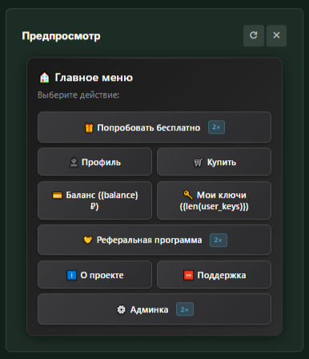

# 🛍️ Remnawave ShopBot

> **Telegram-бот для полностью автоматизированной продажи VPN-конфигураций с веб-панелью управления**
>  

<div align="center">

[](https://github.com/CyberERROR/remnawave-shopbot/releases)
[](https://github.com/CyberERROR/remnawave-shopbot/releases)
[](LICENSE)
[](https://github.com/CyberERROR/remnawave-shopbot/commits)
[](https://github.com/CyberERROR/remnawave-shopbot/issues)
[](https://github.com/CyberERROR/remnawave-shopbot/stargazers)
[](https://www.python.org/downloads/)

[Установка](#️-быстрая-установка-под-ключ) • [Документация](#️-первичная-конфигурация) • [Платёжные системы](#-платёжные-системы) • [Скриншоты](#️-скриншоты) • [Поддержка](#-техническая-поддержка)
</div>

---

<p align="center">

</p>

<div align="center">

###  Наш Telegram
[Присоединяйтесь к сообществу](https://t.me/+YV_BO1cmGWw5OTdi)

</div>

---

## 📋 Описание

**Remnawave ShopBot** — комплексное решение для автоматизированной продажи VPN-конфигураций через Telegram. Проект объединяет мощный Telegram-бот с интуитивной веб-панелью на базе Tabler для полного управления услугой.

---

## ✨ Основные возможности

- ✅ **Telegram-бот** с автоматизированной воронкой продаж (онбординг → платёж → конфиг)
- ✅ **Веб-панель управления** хостами, тарифами, пользователями и платежами
- ✅ **Платёжные системы**: YooKassa, YooMoney, Platega, CryptoBot, Heleket, TON Connect, Telegram Stars
- ✅ **Спидтесты**: SSH-speedtest и Net-Probe для мониторинга серверов
- ✅ **Реферальная система** с гибкими моделями начисления
- ✅ **Техсаппорт** с внешним ботом или контактом
- ✅ **Принудительная подписка** на канал/чат
- ✅ **Админ-меню** для управления из Telegram
- ✅ **Дашборд мониторинга** статистики и событий
- ✅ **Конструктор кнопок** для кастомизации интерфейса

---

## 🖼️ Скриншоты

<details>
<summary><b>📸 Показать скриншоты</b></summary>

<br>

| Веб-панель | |
|:---:|:---:|
|  |  |
| Дашборд | Настройки |
|  |  |
| Рефералы | Спидтесты |
|  |  |
| Мониторинг системы | Конструктор кнопок |

| Telegram-бот | |
|:---:|:---:|
|  |  |
| Главное меню | Настройки и помощь |
|  |  |
| Админ-меню | Предпросмотр меню |

<sub>💡 Клик по картинке откроет оригинал в полном размере</sub>

</details>

---

## ⚠️ Требования к серверу

- 🐧 **ОС**: Ubuntu 20.04+ / Debian 11+
- 🔑 **Доступ**: SSH с правами root
- 🌐 **Домен**: A-запись должна указывать на IP сервера
- 📦 **Remnawave Platform**: установлена на целевых хостах
- 💾 **Ресурсы**: 1GB RAM, 10GB свободного места (минимум)

---

## 🛠️ Быстрая установка «под ключ»

Установочный скрипт автоматически развернёт Docker, Nginx, Certbot, бота и панель.

### 1️⃣ Подключитесь по SSH

```bash
ssh root@your-server-ip
```

### 2️⃣ Запустите установщик

```bash
curl -sSL https://raw.githubusercontent.com/CyberERROR/remnawave-shopbot/main/install.sh | bash
```

### 3️⃣ Следуйте инструкциям

Установщик запросит:
- **Домен** (например: `shop.example.com`)
- **Email** для SSL-сертификата (Let's Encrypt)
- **Порт вебхуков** (443 или 8443, рекомендуется 8443)

Скрипт автоматически:
- ✅ Установит Docker и Docker Compose
- ✅ Настроит Nginx как reverse proxy
- ✅ Выпустит SSL-сертификат через Certbot
- ✅ Поднимет контейнеры с ботом и панелью
- ✅ Настроит автообновление сертификата

### 4️⃣ После установки

```
🎉 Установка завершена!

Веб-панель:      https://shop.example.com/login
Логин:           admin
Пароль:          admin

📝 Важно: Немедленно смените пароль в панели!
```

---

## 🔄 Управление и обновления

Все команды выполняются в папке проекта:

```bash
cd /root/remnawave-shopbot
```

### 📋 Основные команды

```bash
# Просмотр логов в реальном времени
docker-compose logs -f

# Перезапуск контейнеров
docker-compose restart

# Остановка (контейнеры остаются)
docker-compose stop

# Полная остановка с удалением контейнеров
docker-compose down

# Запуск в фоне
docker-compose up -d

# Пересборка и запуск
docker-compose up -d --build

# Очистка логов Docker
truncate -s 0 /var/lib/docker/containers/*/*-json.log
```

### 🆕 Обновление до последней версии

```bash
# Запустить установщик (загружает свежую версию)
curl -sSL https://raw.githubusercontent.com/CyberERROR/remnawave-shopbot/main/install.sh | bash

```

### 🔄 Пересоздать контейнеры в ручную
```bash
cd /root/remnawave-shopbot && docker-compose down && docker-compose up -d --build

```

### 🗑 Полное удаление
```bash
# Запустить скрипт удаления (полностью удаляет бота и связанные контейнеры)
curl -sSL https://raw.githubusercontent.com/CyberERROR/remnawave-shopbot/main/uninstall.sh | bash
```

---

## ⚙️ Первичная конфигурация

| 🛡️ Безопасность | 🤖 Telegram-бот |
| :--- | :--- |
| 1. Откройте панель: `https://domain.com/login`<br>2. Авторизуйтесь: `admin` / `admin`<br>3. **Немедленно смените** пароль в **Настройки → Настройки панели** | В **Настройки → Telegram параметры**:<br>• **Токен** — от [@BotFather](https://t.me/botfather)<br>• **Имя** — username бота<br>• **ID админа** — ваш ID от [@userinfobot](https://t.me/userinfobot) |
| 🌐 Remnawave хосты | 💳 Тарифы и запуск |
| В **Настройки → Управление хостами**:<br>• **URL**: `https://host.example.com:10443`<br>• **API**: доступы к Remnawave API<br>• **SSH**: адрес, порт, юзер (для спидтеста) | 1. Создайте пакеты в разделе **Тарифы**<br>2. Сохраните все настройки<br>3. Нажмите **«Запустить бота»** в шапке панели |

<p align="center">🎊 <b>Готово! Бот принимает заказы.</b></p>

---

## 💳 Платёжные системы

Откройте **Настройки → Платёжные системы** и выберите нужные способы оплаты.

| 🟡 YooKassa | 🔗 Platega |
| :--- | :--- |
| 1. Заполните поля:<br>• `yookassa_shop_id`<br>• `yookassa_secret_key`<br>• Почта для чеков (опц.)<br>2. Установите вебхук:<br><code>https://domain.com/yookassa-webhook</code> | 1. Заполните:<br>• `Merchant ID`<br>• `API Key`<br>2. Настройте вебхук:<br><code>https://domain.com/platega-webhook</code> |
| 🤖 CryptoBot (Telegram Stars) | 💎 Heleket |
| 1. `@CryptoBot` → **Crypto Pay**<br>2. Скопируйте токен в `cryptobot_token`<br>3. Включите вебхуки на:<br><code>https://domain.com/cryptobot-webhook</code> | Заполните обязательные поля:<br>• `heleket_merchant_id`<br>• `heleket_api_key`<br><br><i>Настройка вебхуков не требуется.</i> |

|⚡ TON Connect|
| :--- |
| ⚡ (опционально)
Для отображения курсов и оплаты в TON: <br> - `ton_wallet_address` — адрес вашего кошелька <br> - `tonapi_key` — ключ API для получения актуальных курсов|

---

## 🔗 Принудительная подписка

Настройки в веб-панели (**Настройки → Общие**):

| Параметр | Назначение |
|:---|:---|
| **force_subscription** | Включить обязательную подписку (`true`/`false`) |
| **channel_url** | Ссылка на канал/группу для подписки |
| **terms_url** | Ссылка на условия использования |
| **privacy_url** | Ссылка на политику конфиденциальности |

⚠️ **Важно**: Бот должен быть администратором канала для проверки подписки!

---

## 🧪 Спидтесты и мониторинг

Доступны **2 метода** проверки скорости:

### 📊 SSH-Speedtest
- Запускает `speedtest-cli` на удалённом сервере
- Требует SSH доступа и установленного speedtest
- **Автоустановка**: из админ-меню бота или веб-панели

**Запуск:**
```
Бот:   Админ-меню → Speedtest → Выбрать хост
Панель: Дашборд → Кнопка "Run speedtests"
```

### 🌐 Net-Probe
- Проверка доступности и пинга HTTP
- Без необходимости SSH
- Более быстрый результат

**Результаты**: автоматически сохраняются в БД и видны на дашборде у каждого хоста.

---

## 🤝 Реферальная система

**Основные параметры** в **Настройки → Общие**:

### Типы начисления
- 📊 **Процент с покупки** реферала (например, 10%)
- 💰 **Фиксированная сумма** за каждую покупку
- 🎁 **Бонус приглашающему** при регистрации реферала

### Дополнительно
- **Скидка реферала**: процент скидки для приглашённого
- **Минимум вывода**: минимальная сумма для перевода средств

### Рефссылка
Автоматически генерируется в формате:
```
https://t.me/<bot_username>?start=ref_<telegram_id>
```

---

## 🆘 Техническая поддержка

Доступны **2 режима** поддержки пользователей:

### 1️⃣ Внешний саппорт-бот
```
Параметры:
• support_bot_token    → токен бота поддержки
• support_bot_username → username бота
• support_text         → текст кнопки

Пользователь переходит в отдельного бота по кнопке "Помощь"
```

### 2️⃣ Внешний контакт
```
Параметр:
• support_user → username контакта (например: @admin)

Кнопка ведёт в личные сообщения контакту
```

### Расширенные сценарии
```
Параметр:
• support_forum_chat_id → ID форума/топиков для сложных вопросов
```

---

## 🐛 Баги и предложения

Если вы нашли баг или хотите предложить улучшение:

1. Проверьте [Issues](https://github.com/CyberERROR/remnawave-shopbot/issues) — возможно, это уже известно
2. Создайте новый issue с описанием:
   - Что произошло
   - Как это воспроизвести
   - Ваша ОС и версия бота

---

## 📄 Лицензия

Проект распространяется по лицензии [GPLv3](LICENSE).

Вы можете свободно использовать, изучать, модифицировать и распространять этот код при условии соблюдения лицензии.

---

<div align="center">

**Сделано с ❤️ для сообщества**

[⭐ Звёздочка на GitHub](https://github.com/CyberERROR/remnawave-shopbot) поддержит развитие проекта

